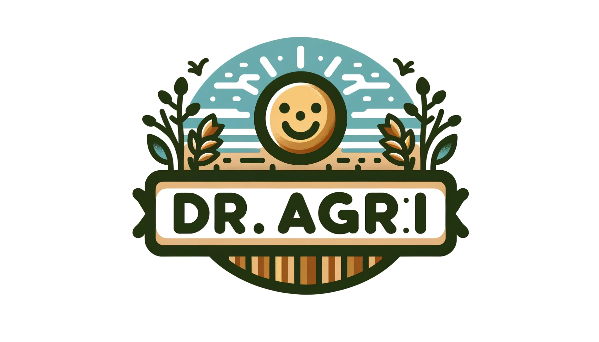
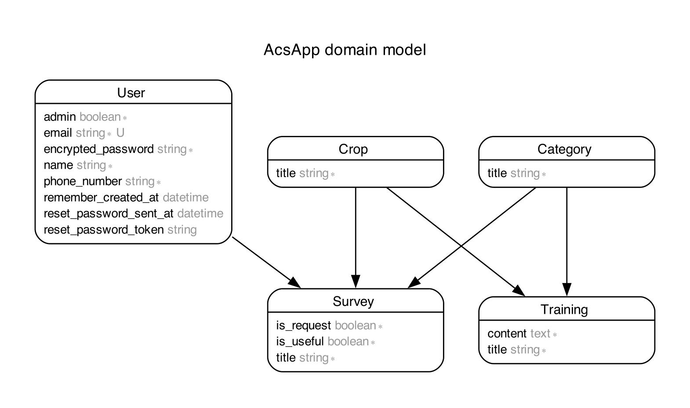

# ドクターアグリ: 農業専門チャットボット


http://agribot-test.site

## サービス概要
[ドクターアグリ](http://agribot-test.site)は、農業業界に新規参入する企業担当者と農業コンサルタントを支援する、質問対応とフィードバック収集機能を備えたチャットボットアプリです。

## ユーザー層
- **新規参入企業担当者**: 農業についての質問をチャットボットで解決。
- **農業コンサルタント**: アンケートを通じて得たフィードバックを分析し、チャットボットを改善。

## 開発背景
農業コンサルタントは、日々同様の質問に対応することが多く、効率化のためにAIを活用した解決策を模索しています。

## 主な機能
- **チャットボット機能**: ユーザーからの質問にAIが回答。
- **アンケート機能**: ユーザーフィードバックの収集。
- **アンケート分析機能**: フィードバックの分析と改善案の導出。
- **トレーニングデータ蓄積**: AIの精度向上のためのデータ蓄積。
- **メール通知機能**: 重要な通知のメール送信。
- **ユーザーログイン**: アクセス制限とセキュリティの向上。

## 使用技術
- **バックエンド**: Ruby 3.0.1, Rails 6.1.7.6
- **フロントエンド**: JavaScript, Bootstrap
- **データベース**: PostgreSQL
- **依存関係**: Devise, Kaminari, Ransack など
- **インフラストラクチャ**: AWS EC2
- **外部サービス**: [Chatsimple](https://www.chatsimple.ai/)

#### 実行手順
```
$ git clone git@github.com:TsuruKouhei/acs-project.git
$ cd acs-project
$ bundle install
$ yarn install
$ rails db:create && rails db:migrate
$ rails s
```

## リンク

- [カタログ設計](https://docs.google.com/spreadsheets/d/1Pki6_pHy6GR1Kd1n-f0usFPvvEuaxC-C5C_Rdmya9Iw/edit#gid=1245264142)
- [テーブル定義書](https://docs.google.com/spreadsheets/d/1Pki6_pHy6GR1Kd1n-f0usFPvvEuaxC-C5C_Rdmya9Iw/edit#gid=1707745237)
- [ワイヤーフレーム](https://docs.google.com/presentation/d/1yG9UPbMk0O3kFZC_L9NEeEvXAlcJC97JlmFDlE0453w/edit?usp=sharing)
## ER図

